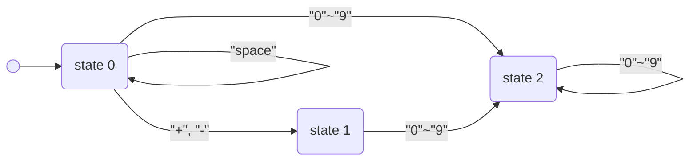

**原題**：[LeetCode 8. String to Integer (atoi)](https://leetcode.com/problems/string-to-integer-atoi/)

**難度**：Medium

**主題**：String

> Implement the myAtoi(string s) function, which converts a string to a 32-bit signed integer (similar to C/C++'s atoifunction).

> The algorithm for myAtoi(string s) is as follows:

1. Read in and ignore any leading whitespace.
2. Check if the next character (if not already at the end of the string) is '-' or '+'. Read this character in if it is either. This determines if the final result is negative or positive respectively. Assume the result is positive if neither is present.
3. Read in next the characters until the next non-digit character or the end of the input is reached. The rest of the string is ignored.
4. Convert these digits into an integer (i.e. "123" -> 123, "0032" -> 32). If no digits were read, then the integer is 0. Change the sign as necessary (from step 2).
5. If the integer is out of the 32-bit signed integer range [-2^31, 2^31 - 1], then clamp the integer so that it remains in the range. Specifically, integers less than -231 should be clamped to -231, and integers greater than 231 - 1 should be clamped to 231 - 1.
6. Return the integer as the final result.

**Note:**

- Only the space character ' ' is considered a whitespace character.
- **Do not ignore** any characters other than the leading whitespace or the rest of the string after the digits.

> 需要實現一個類似C/C++中atoi()的函式。

**Example 1:**

```text
Input: s = "42"
Output: 42
Explanation: The underlined characters are what is read in, the caret is the current reader position.
Step 1: "42" (no characters read because there is no leading whitespace)
        ^
Step 2: "42" (no characters read because there is neither a '-' nor '+')
        ^
Step 3: "42" ("42" is read in)
          ^
The parsed integer is 42.
Since 42 is in the range [-231, 231 - 1], the final result is 42.
```

**Example 2:**

```text
Input: s = "   -42"
Output: -42
Explanation:
Step 1: "   -42" (leading whitespace is read and ignored)
           ^
Step 2: "   -42" ('-' is read, so the result should be negative)
            ^
Step 3: "   -42" ("42" is read in)
              ^
The parsed integer is -42.
Since -42 is in the range [-231, 231 - 1], the final result is -42.
```

**Example 3:**

```text
Input: s = "4193 with words"
Output: 4193
Explanation:
Step 1: "4193 with words" (no characters read because there is no leading whitespace)
        ^
Step 2: "4193 with words" (no characters read because there is neither a '-' nor '+')
        ^
Step 3: "4193 with words" ("4193" is read in; reading stops because the next character is a non-digit)
            ^
The parsed integer is 4193.
Since 4193 is in the range [-231, 231 - 1], the final result is 4193.
```

**Constraints:**

- 0 <= s.length <= 200
- s consists of English letters (lower-case and upper-case), digits (0-9), ' ', '+', '-', and '.'.

## Solution

### 暴力解

**思路**：沒啥好說的，題幹已經描述的很清楚了。

邊界處理跟[「Reverse Integer｜數字反轉」](/notes/reverse-integer)是同一件事，差別在這題要把結果夾進範圍內，那題超出範圍直接回 0。

**複雜度**：O(n)

```python
class Solution:
    def myAtoi(self, s: str) -> int:
        length = len(s)
        res, idx = 0, 0
        is_positive = True
        # remove space
        while idx < length and s[idx].isspace():
            idx = idx + 1
        # determine positive or negative
        if idx < length and (s[idx] == '+' or s[idx] == '-'):
            is_positive = False if s[idx] == '-' else True
            idx = idx + 1
        # calculate
        while idx < length and s[idx] >= '0' and s[idx] <= '9':
            res = res * 10 + int(s[idx])
            idx = idx + 1
        # boundary check
        return min(res, 2**31 - 1) if is_positive else max(-res, -2**31)
```

**結果**：35ms, beats 86.31% of users with Python3.

### 確定有限自動機（deterministic finite automaton, DFA）

**思路**：根據題幹敘述，可以將程式分為以下三種狀態：



實做出這個DFA即可完成題目要求。

[「Zigzag Conversion｜之字變換」](/notes/zigzag-conversion)的暴力解也用了一個 state 變數控制讀取方向，只是沒有寫成完整的狀態機。

**複雜度**：O(n)

```python
class Solution:
    def myAtoi(self, s: str) -> int:
        length = len(s)
        res, idx, state = 0, 0, 0
        is_positive = True

        if length == 0:
            return 0

        for current in s:
            if state == 0:
                if current == ' ':
                    continue
                if current == '+' or current == '-':
                    is_positive = current != '-'
                    state = 1
                    continue
                if current.isdigit():
                    state = 2
                    res = res * 10 + int(current)
                    continue
                return 0

            if state == 1:
                if current.isdigit():
                    state = 2
                    res = res * 10 + int(current)
                    continue
                return 0

            if state == 2:
                if current.isdigit():
                    res = res * 10 + int(current)
                else:
                    break

        return min(res, 2**31 - 1) if is_positive else max(-res, -2**31)
```

**結果**：29ms, beats 97.75% of users with Python3.
